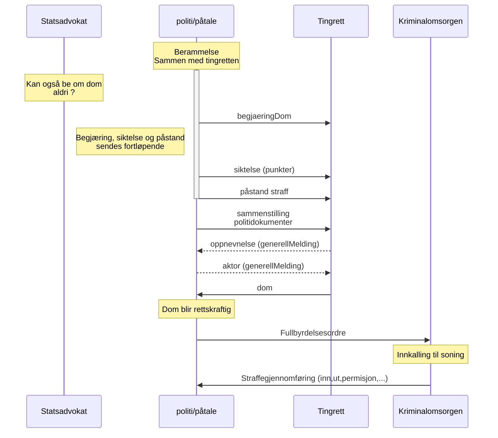

# Bestilling av varetektsplass (ikke i produksjon)
Versjon 1.0 er første versjon som vi skal i produksjon med.
* [JSON Schema](arbeidsversjon/bestillingAvVaretektsplass.schema.json)
* [Eksempler](arbeidsversjon/eksempelfiler/)

## Headere forsendelse justisHub
SchemaName=BEGJAERING_DOM  
SchemaVersion=1.0
[RFC](../../../rfc/MessageName-header.md)

[Se changelog for endringer](changelog.md)

## Status
Jobber med første utkast.

## Flyt
