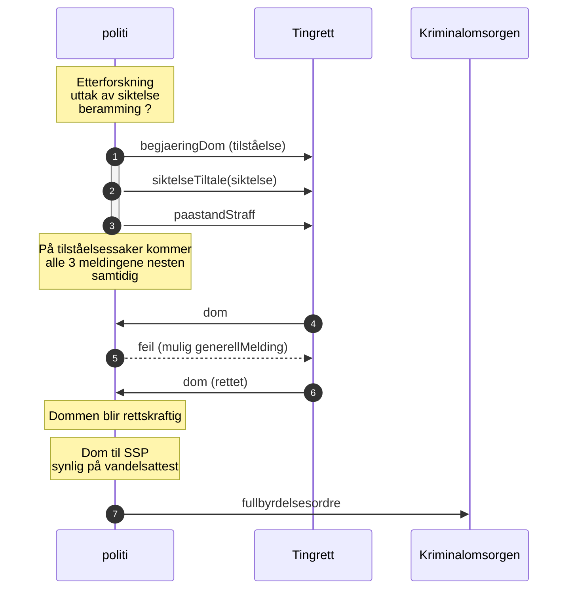
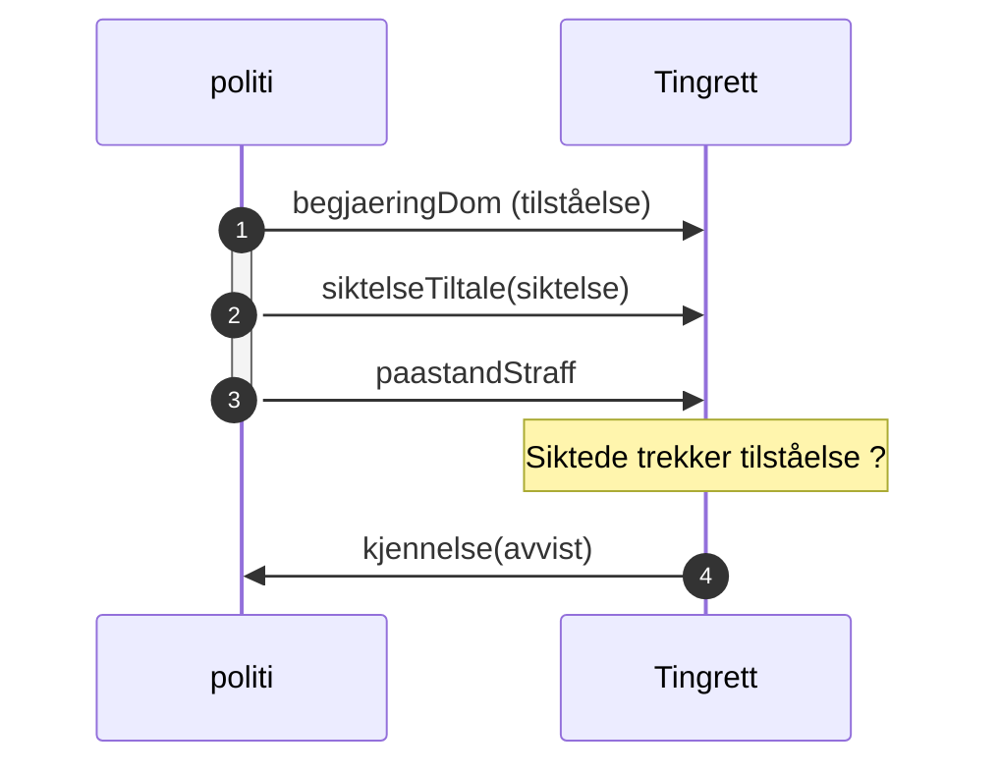

# Kontrakter for dommer
Her ligger kontrakter for begjæring av dom fra påtale og dom fra tingretten som implementeres i håndtering av tilståelsessaker i ESAS III

Kontrakter for fullbyrdelse og anke vil bli liggende på andre kataloger (antagelig)

## Tilståelsessaker
Heltrukne linjer er prioritert i 2024. Annen flyt skal bruke dagens flyt (epost, telefon, ...)

### Normal flyt - med retting

### Avvis behandling
Vi skal også støtte kjennelse (avvist) from domstolene hvis domstolene ikke vil behandling begjæringen.

Prioritert rekkefølge på definisjon og implementasjon av meldinger fra politiet er:
siktelseTiltale, begjaeringDom, paastandStraff, fullbyrdelsesOrdre

Politiet må håndtere retting av dom, dvs. at dommen kommer på nytt fra domstolene.

## Meldinger
### [Begjæring om dom](./begjaeringDom/readme.md)