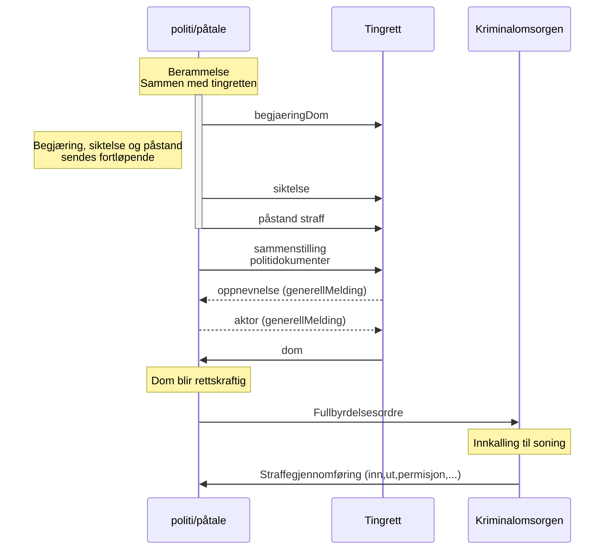

# Dom

## Overordnet beskrivelse
Rettsbehandlinger i retten som skal ende opp i dom fra retten. Det skal inkludere anke og dom fra høyere rettsinstanser, der anke meldinger blir liggende andre steder.

Eksempel med tilståelsessak som ikke blir anket i første omgang.
Siktelse, tiltale og forelegg har alle samme format og innhold så vi lager en felles melding for siktelse/tiltalepunkter.
## Plan - 2024
Vi begynner med tilståelsessaker for å holde scope nede i første leveranse.
### Tilståelsessaker
Begjæring om dom og dom i tilståelsessaker.
Trafikksaker må vi støtte, mangler informasjon på disse sakene.
Trenger kanskje støtte for generelle meldinger slik at mest mulig av rettsbehandling vises i ny Elsa app.
#### Ikke med
* Anke over dom, kjøres på gammelmåten.
* Beramming, oppnevnelse av forsvarer og aktor. I det hele tatt allt annet enn start og slutt til tingretten.
* Anke til lagmannsretten på vedtatt forelett (ikke via tingretten)
### kombisaker - varetekt og tilståelse 
Kanskje ferdig før produksjonssetting,
### Tilståelsessaker uten anke
* De fleste tilståelsessaker blir ikke anket så vi tar ikke det med i første fase
