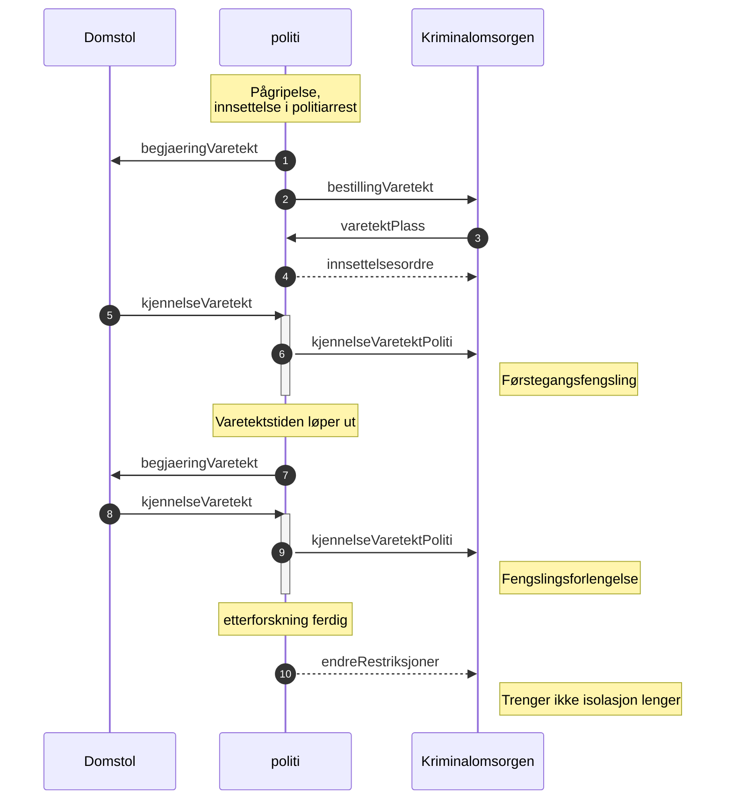

# Bestilling av varetektsplass
Bestilling av varetektsplass har mye data relatert til straffesaken, siktede med helse og risiko informasjon og restriksoner. Flyt er vist nederst, mulig vi må jobbe mer med helse og risiko oppdateringer som kan endre seg etter en natt i arresten.  
[Se changelog for endringer](changelog.md)
## Headere forsendelse justisHub
SchemaName=BESTILLING_VARETEKTSPLASS  
SchemaVersion=1.0  
[RFC message name header](../../../rfc/MessageName-header.md)
## Status - ikke godkjent
Begge parter må være enige om innholdet.  
Se [PR 75](https://github.com/domstolene/ESAS/pull/75), må svare ut flere av disse.
## Data
### Risiko
Bruker må velge en av valgene.
### Helse
Bruker må velge en av valgene.  
*Behov for medisiner er med her og i tilstand i arresten frontend vi har nå, avklares.*
### Tilstand i arresten
Bruker må velge en av valgene.  
*Ikke tatt med behov for medisiner som er i frontende beskrivelse nå, avklaring*
### Restriksjoner / isolasjon
*Prosessen med disse er ikke helt klare, hvordan skaffer personen som bestiller seg informasjon om det hvis begjæring om varetekt ikke er laget ennå*
1. Foreløpig ikke noe fritekstfelt i vår frontend, men vi må kanskje ha den muligheten for å detaljere om hvem som ikke skal treffe hvem i arresten.
1. Bestilling av varetektsplass og timing, før/etter begjæring om varetekt og før/etter kjennelse ? 
### Siktelse
Strukturert siktelse er ikke en del av 1. pilot og vil komme med i neste versjon av skjema, [se tidligere definisjon](./../felles/siktelse-lovbud.json).
### Siktet person som skal i varetekt
Informasjon om siktede og kobling til en av straffesakene i siktelsen.
### Straffesaksinformasjon
Listen over straffesaker inneholder informasjon kun fra hovedsaken som bestillingen er koblet til.  
Uten siktelsesinformasjon (lovbud) og KrimType til å begynne med. KrimType er i Schema og vi jobber med å få med denne.
## Ønsker / mangler
### Pågrepet kommune
Pågrepet kommune brukes til NAV av Kriminalomsorgen fordi det er det lokale NAV kontoret i pågrepet kommune som har ansvaret ?

## Avklaringer
Hvordan skal det virke med sentralt til Kriminalomsorgen og direkte til et fengsel?
Vanligvis sendes det til KDI sentralt og bruker hos politiet blir ikke bedt om å velge fengsel. Det er mulig å velge fengsel direkte, det kan være en advarsel.

Schema vil i alle fall innehold bare en mottakerOrganisasjon som er enten KDI eller et fengsel, KDI kan implementere at det rutes til sentralt mottak hvis det er feil at det skal rett til fengsel.

Kan vi ha med det som tekst på kvittering ?
## Flyt
Kopi av den som er laget for kjennelseVaretektKDI MR og vil blir flyttet til et felles sted for dokumentasjon.

* Kvitteringer skal sendes på alle meldinger og er ikke vist i diagrammet.
* varetektsplass er tilbud på plass i et gitt fengsel, se [bestillingVaretekt](../bestillvaretektsplass/readme.md)
* Innsettelsesordren er vist som et eksempel og vil bli brukt hvis kjennelsen ikke er klar til når personen skal flyttes til Kriminalomsorgen.
* [endreRestriksjoner](../endreRestriksjoner/readme.md) så påtale kan lette på restriksjoner. Ikke planlagt når denne skal implementeres.
