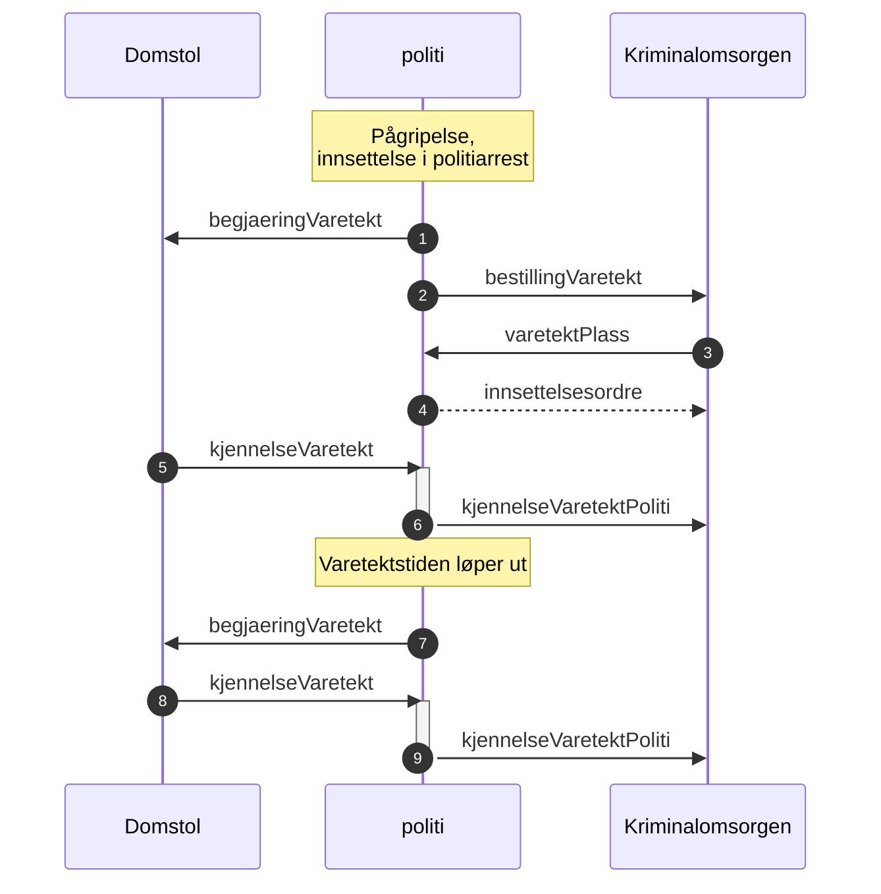

# Kjennelse på varetekt til Kriminalomsorgen (kjennelseVaretektPoliti)
Når politiet mottar kjennelse så blir kjennelsen strukturert og med kjennelse/rettsbok PDF rutet videre til Kriminalomsorgen.
Det skal legges ved data om straffesakene, se nedenfor.

Denne meldingen skal brukes på førstegangsfengslinger og forlengelser i etterkant og den erstatter [oppdaterVaretekt](../oppdatervaretekt/readme.md) sammen med meldingen [endreRestriksjoner](../endreRestriksjoner/readme.md)

[Endringslogg](changelog.md)
## Headere forsendelse justisHub - [RFC](../../../rfc/MessageName-header.md)
SchmaName=KJENNELSE_VARETEKT_POLITI  
SchemaVersion=1.0  

Versjon 1.0 er første versjon som skal til pilot høsten 2023 og er en del av oppdaterVaretekt som skal utgå og erstattes av 
## Status - ikke godkjent
Begge parter må være enige om innholdet før vi kan gå i produksjon.
## Data
I tillegg til forsendelse og detaljer om personen så blir følgende data med.
### Straffesaksdata
I første omgang så kommer informasjon kun fra hovedsaken og det kommer ikke med lovbud. Når siktelsen kommer (sammen med tilståelsessaker) så vil vi kunne sende med informasjon på alle straffesaker som siktede er involvert i.
### Data om helse, risiko og tilstand
[Kommer i bestillingVaretekt meldingen](../bestillvaretektsplass/readme.md) *oppdatert beskrivelse på data*
### Det legges ikke ved PDF dokumenter fra straffesaken
Dvs. siktelses PDF blir ikke med, se avklaring nedenfor. Kjennelsen fra domstolen på PDF format blir lagt ved oversendelsen.
## Flyt

* Kvitteringer skal sendes på alle meldinger og er ikke vist i diagrammet.
* varetektsplass er tilbud på plass i et gitt fengsel, se [bestillingVaretekt](../bestillvaretektsplass/readme.md)
* Innsettelsesordren er vist som et eksempel og vil bli brukt hvis kjennelsen ikke er klar til når personen skal flyttes til Kriminalomsorgen.
## Avklaringer
I arbeidet med fengslinger og informasjon mellom politi og Kriminalomsorgen er det gjort noen antagelser i den nye meldingen for kjennelse fra domstolene.
### Straffesaksinformasn (Siktelse) og data til Kriminalomsorgen
Kjennelsen fra domstolen inneholder ikke detaljer om siktelsen til den personen som skal varetektsfengsles og den strukturerte kjennelsen er heller ikke klar fra politiet.
1. Siktelsesdokumentet (PDF) blir ikke med da det inneholder informasjon om andre og detaljert beskrivelse av hva som skjedde.
### Siktelsesinformasjon til senere
Senere så vil vi ta med siktelsesinformasjon inkludert lovbud på alle straffesaker siktede er siktet for.
1. Grunnlagstekst er en beskrivelse av selve hendelsen, trenger Kriminalomsorgen den?
### Kjennelse
Det kommer småjusteringer på kjennelsen ennå.