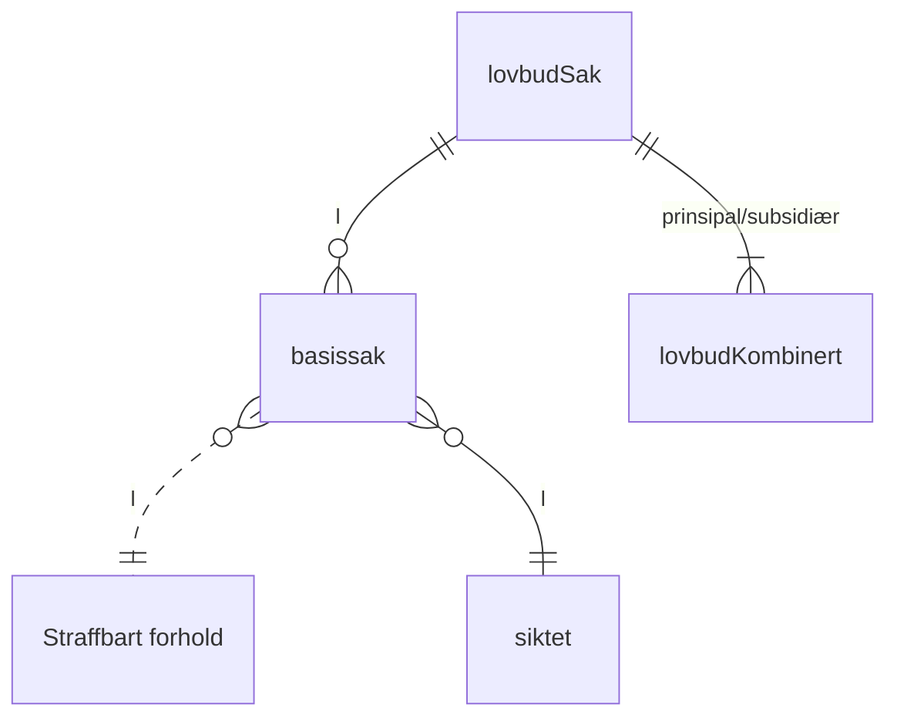
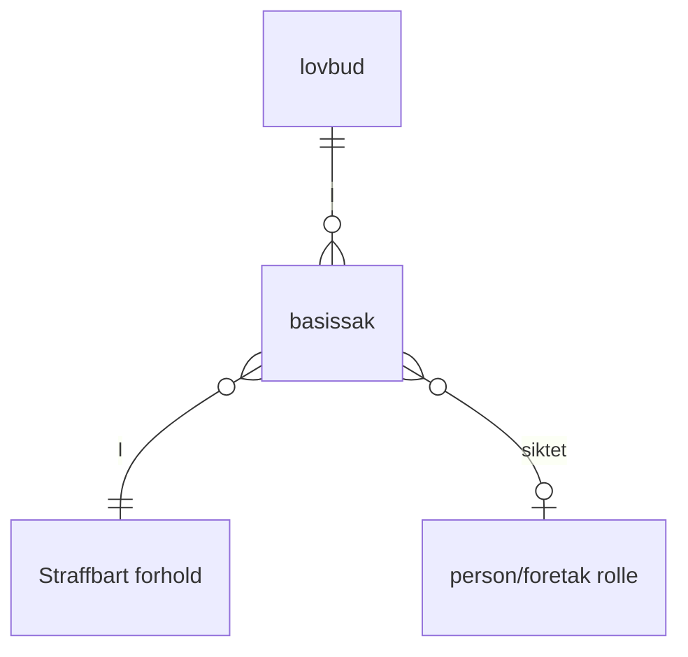

# Basissak
## Definisjon i siktelse/tiltale straffesaker i BL
En person/fortakt, en straffbar handling, ett lovbud du blir funnet skyldig i.
Ser på prinsipal og subsidiært lovbud som to mulige lovbud en siktet kan bli funnet skyldig i (Harmoniseringsrapporten sier to basissaker).
 a
Et straffbart forhold er i BL straffesaken med tid og sted samt koblinger til alle roller i saken.
Det er forskjellig grunnlag på prinsipal og subsidiært lovbud. Ser på det som to mulige beskrivelser av det samme straffbare forholdet.

Hvis en hendelse er flere brudd på loveen så blir det i BL flere straffesaker med samme tid og sted. Dvs. en dupliering av hendelsen.

lovbudSak kan være prinsipal/subsidiært lovbud.
## Harmoniseringsrapporten
"Harmoniseringsrapport – Strukturering av avgjørelser, lover og forskrifter - 2006" 

Basissak - En person, en straffbar handling, ett lovbud  
Straffbart forhold - knytter sammen en hendelse (tid og sted), siktede, fornærmet og lovbud gjennom basissak.  
Rapporten sier at hvis det er en siktelse med et prinsipalt og et subsidiært lovbud så er det to basissaker, samme straffbare forhold.
Siktede vil bare kunne blir kjent skyldig i en av basissakene.
_Hvis du blir frikjent blir du da frikjent for begge eller for det prinsipale?
Hvorfor brukes ikke to poster i tiltalen med det samme, hvorfor bruke et subsidiært lovbud?_

