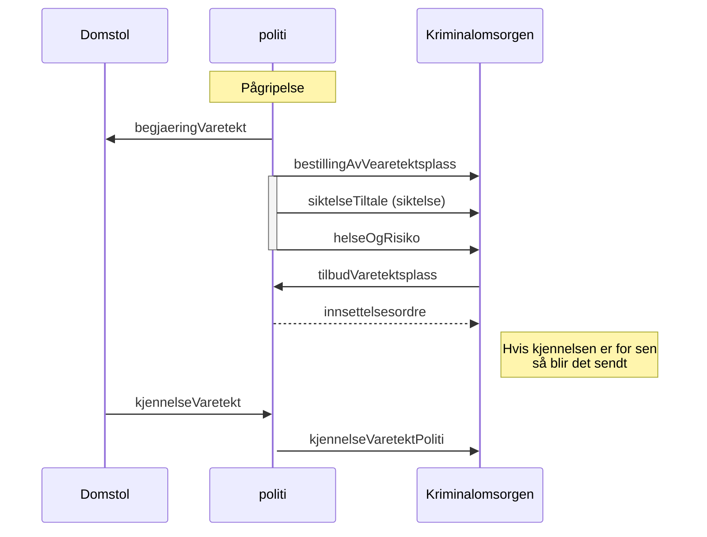

# Meldinger i forbindelse med bestilling av varetektsplass

Melding `svarTilbudVaretektsplass` kan brukes av politiet til å si ifra at varetektsplassen ikke er nødvendig lenger (avslutte bestilling).

[Innsettelsesordren](../innsettelsesordre/readme.md) er kun ordre om innsettelse og skal kun sendes når det er nødvendig.
