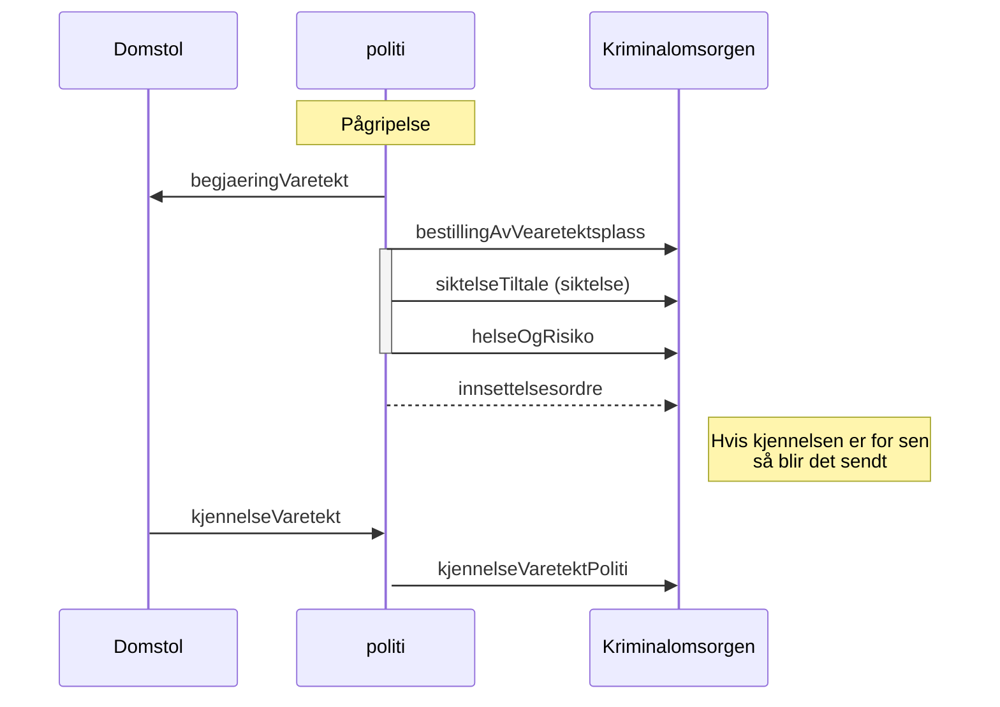

# Meldinger i forbindelse med bestilling av varetektsplass

```mermaid
sequenceDiagram
  participant ds as Domstol
  participant pd as politi
  participant ko as Kriminalomsorgen
  Note over pd: Pågripelse
  pd->>ds:begjaeringVaretekt
  pd->>ko:bestillingAvVearetektsplass
    activate pd
    pd->>ko:siktelseTiltale (siktelse)
    pd->>ko:helseOgRisiko
  deactivate pd
  pd-->>ko:innsettelsesordre
  note right of ko: Hvis kjennelsen er for sen<br/>så blir det sendt
  ds->>pd:kjennelseVaretekt
  activate pd
  pd->>ko:kjennelseVaretektPoliti
```

[Innsettelsesordren](../innsettelsesordre/readme.md) er kun ordre om innsettelse og skal kun sendes når det er nødvendig.
