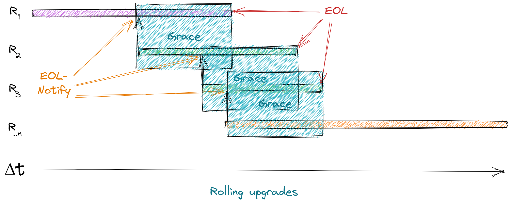

## Rullende oppgraderingsvindu på JustisHub

**To be Reviewed By**: Martin Myran, Lasse Motrøen

**Authors**: Carl Fredrik Bøkestad

**Status**: Draft

### Problem

I forbindelse med oversendelser av meldinger over JustisHub trenger vi et system der vi kan endre/oppgradere kontrakter uten nedetid og uten å innføre _breaking changes_.

Det er ulike virksomheter som er koblet til JustisHub så det er viktig at alle parter er i stand til å gjøre oppgraderinger uten at vi blir for avhengige av hverandre - f.eks. slik at vi slipper samtidige oppgraderinger.

### Løsningsforslag

Forslaget går ut på at ved en oppgradering av kontrakt er avsender/produsent av melding ansvarlig for å sende ut alle versjoner av meldingen i en _grace periode_ på samme kø.
*Grace perioden* for et gitt miljø, må blir enige om på forhånd - f.eks. 1 måned (eller til at mottaker har informert om at de ikke lenger har behov for tidligere versjoner)

Header på meldingene må da inneholde et versjonsnummer som tilsvarer versjonen på kontrakten meldingen skal reflektere. Mottaker/konsument av melding velger da selv hvilken versjon av meldingen den skal behandle ved å se på versjonsnummeret. Andre versjoner av meldingen skal kastes/ignoreres.

Ved introduksjon  av ny versjon er det da avsender sitt ansvar å kommunisere *End of life" på forrige versjon til mottaker.

**Eksempel**:

* Domstolen sender meldinger til politiet på _versjon 1_.
* Ved en oppgradering av kontrakt starter domstolen å sende meldinger på _versjon 1 og 2_ på samme kø fra 01.10.2022.
* Domstolen må samtidig informere politiet om at versjon 1 har EOL 1.11.2022.
* Politiet kan da fortsette å behandle meldingene markert med _versjon 1_ helt til de får oppgradert sine systemer til å behandle meldinger merket med _versjon 2_
* Domstolen forplikter seg da til å sende meldinger på versjon 1 og 2 minst frem til 1.11.2022 (eller til at politiet har informert om at de er på _versjon 2_)

Det vi da oppnår vi at både begge virksomhetene kan implementere oppgradering av kontrakten i takt med sin utrullings sekvens.
I teorien kan avsender være nødt til å sende mange versjoner av den samme meldingen i en periode dersom der det er flere endringer over kort tid.

Med denne løsningen går man fra å være en teknisk utfordring til en mer merkantil beslutning.

*Skisse*

*Grace* Periode der flere versjoner av den samme meldingen sendes

*EOL Noitfy" Når avsender informerer mottaker om at en gitt versjon ikke publiseres lenger 

*EOL* - Når en gitt versjon ikke publiseres lenger

### Alternative løsninger:
* Simultane oppgraderinger for alle brukere av JustisHub
* Avsender sender meldinger på i alle verjoner i grace-perioden, men ikke på samme kø (som beskrevet over), men på _egne versjonerte køer_ (Altså én kø per versjon)
* Mottaker av melding implementerer alltid oppgraderinger av meldinger først. Slik at mottaker f.eks. kan behandle versjon 1 og 2, så kan produsent sende versjon 1 i grace-perioden, men må over til versjon 2 innen perioden er over.
* Andre forslag??

### FAQ
<Svar til vanlige spørsmål stilt etter RFC til dette forslaget>

